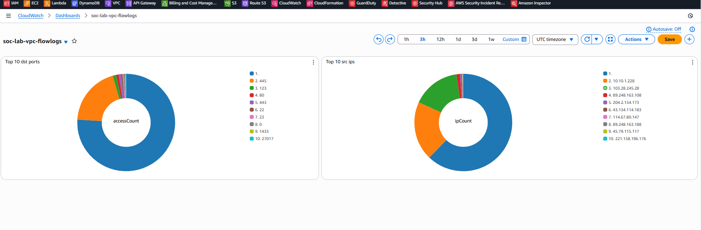

# AWS SOC Lab – Honeypot, Splunk, and Cloud Logging

This lab project sets up an AWS-based Security Operations Center (SOC) environment to monitor honeypot traffic using CloudWatch with optional Splunk deployment TBA.

## ✅ Lab Summary

Deployed a **Dionaea honeypot EC2 instance** and a **Splunk EC2 instance**. Configured logging across services and built out **CloudWatch dashboards** to visualize attacker traffic.

## ☁️ Environment & Stack

- **EC2 Instances**: Dionaea Honeypot (Ubuntu-based AMI), Splunk (Amazon Linux)
- **VPC Components**:
  - Public and Private Subnets
  - Elastic IP, SSM Endpoints
  - Security Groups: `splunk-sg`, `honeypot-sg`
- **AWS Services Used**:
  - Systems Manager (SSM) with VPC endpoints
  - CloudWatch Logs & Dashboards
  - CloudTrail to S3
  - VPC Flow Logs to CloudWatch
  - IAM Roles (SSM + CloudWatchAgent)
- **Log Sources**:
  - Dionaea logs via CloudWatch Agent
  - VPC Flow Logs
  - CloudTrail logs in S3 (future ingestion)
- **Security Services (Enabled but pending full config)**:
  - Amazon GuardDuty
  - AWS Detective
  - AWS Security Hub
  - Amazon Inspector

---

## 🛠️ Configuration Steps

### Dionaea Honeypot
- Launched hardened Marketplace AMI (Ubuntu 22)
- Verified exposed services: FTP, SMB, HTTP, MySQL, Telnet
- SSH restricted to port 52222 from admin IP only
- Installed CloudWatch Agent + validated connectivity to logs endpoint

### Splunk EC2
- Amazon Linux 2023 instance
- Installed Splunk Enterprise via RPM
- Inbound port 8000 allowed via SG for Splunk Web UI

### CloudWatch Logs & Insights
- Log group `honeypot-dionaea-log` created
- Parsed honeypot logs using custom Log Insights queries
- Built dashboard widgets:
  - Top Rejected Ports
  - Top Source IPs
  - Temporal trend of connections

### VPC Flow Logs
- Enabled on VPC: `vpc-02793ce57e31ab7ce`
- Log Group: `aws-honeypot-vpc-flowlogs`
- IAM Role: `VPCFlowLogs-Cloudwatch-aws-honeypot`
- Logs every 10 mins with full traffic metadata
- Used in CloudWatch dashboards

---

## 📊 VPC Flow Logs Dashboard

This dashboard tracks rejected ports and scanning IPs across the honeypot VPC:



---

## 🔍 Logs Insights Query Example

```sql
fields @timestamp, @message
| filter @message like /accept/
| parse @message "*accept/*/* [*:*->*:*]*" as proto, _, dst_addr, dst_port, src_addr, src_port, _
| stats count() as attempts by dst_port
```

---

## ⚠️ Common Beginner Pitfalls

| Topic | Issue |
|-------|-------|
| SSM | Needs correct IAM + VPC endpoints |
| SSH | Wrong user or open key file permissions |
| CloudWatch | No logs if agent not started/configured |
| Log Parsing | Regex errors are common in parse syntax |
| Private Subnet Access | Needs NAT or VPC endpoints for internet access |

---

## ✅ Next Steps

- Build detection rules inside Splunk
- Connect GuardDuty, Inspector, and Security Hub findings
- Send long-term logs to S3 for archival
- Expand dashboards to visualize TTPs over time

---

Maintained by Kevin as part of a real-world AWS blue team learning lab.
